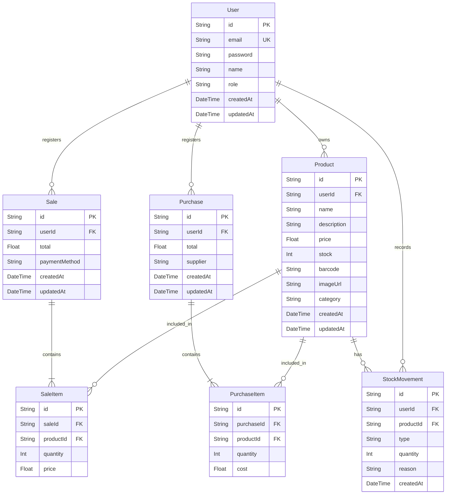

# Entity Relationship Diagram (ERD) - MI NEGOCIO GO

## Diagram

```mermaid
erDiagram
    User ||--o{ Product : owns
    User ||--o{ Sale : registers
    User ||--o{ Purchase : registers
    User ||--o{ StockMovement : records

    Product ||--o{ SaleItem : included_in
    Product ||--o{ PurchaseItem : included_in
    Product ||--o{ StockMovement : has

    Sale ||--|{ SaleItem : contains
    Purchase ||--|{ PurchaseItem : contains

    User {
        String id PK
        String email UK
        String password
        String name
        String role
        DateTime createdAt
        DateTime updatedAt
    }

    Product {
        String id PK
        String userId FK
        String name
        String description
        Float price
        Int stock
        String barcode
        String imageUrl
        String category
        DateTime createdAt
        DateTime updatedAt
    }

    Sale {
        String id PK
        String userId FK
        Float total
        String paymentMethod
        DateTime createdAt
        DateTime updatedAt
    }

    SaleItem {
        String id PK
        String saleId FK
        String productId FK
        Int quantity
        Float price
    }

    Purchase {
        String id PK
        String userId FK
        Float total
        String supplier
        DateTime createdAt
        DateTime updatedAt
    }

    PurchaseItem {
        String id PK
        String purchaseId FK
        String productId FK
        Int quantity
        Float cost
    }

    StockMovement {
        String id PK
        String userId FK
        String productId FK
        String type
        Int quantity
        String reason
        DateTime createdAt
    }
```
